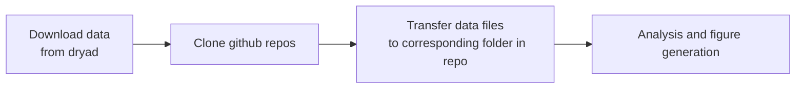

# NHP_fibers_private
https://github.com/igarwood/NHP_fibers contains processed neural data and algorithms to analyze data recorded during neuromodulation experiments described in Garwood, et al., 2023. The codebase also includes functions to characterize multifunctional fiber neurotechnology.  It integrates with several preexisting toolboxes and contains modified functions based on functions written by other researchers (details below). 

The codebase was written by Indie Garwood and the data was collected by Indie Garwood and Alex Major, with assistance from Meredith Mahnke, Josefina Correa, MJ Antonini, Atharva Sahasrabudhe, Youngbin Lee. The work was supported by Polina Anikeeva, Emery Brown, and Earl Miller. 

MIT license

This codebase is shared as part of the open science initiative. While some of the functions may be broadly useful, this codebase was not designed as a generalized toolbox. Any use or adaptation of the analysis herein should cite 
> Garwood, I.C., Major, A.J., Antonini,M.-J., Correa, J., Lee, Y., Sahasrabudhe, A, Mahnke, M.K., Miller, E.K., Brown, E.N., Anikeeva, P. Multifunctional fibers enable modulation of cortical and deep brainactivity during cognitive behavior in macaques. Science Advances. Oct. 2023.

and (when relevant)

> Cajigas I, Malik WQ, Brown EN. nSTAT: Open-source neural spike train analysis toolbox for Matlab. Journal of Neuroscience Methods 211: 245–264, Nov. 2012 http://doi.org/10.1016/j.jneumeth.2012.08.009

The main directory contains 9 subdirectories, 
- behavior
- device_characterization
- device_data
- experimental_data
- LFP
- load_data
- plots
- processed_data
- SUA

The general workflow for getting started with this dataset and codebase:

Setup

    
  1. Download experimental_data and device_data folders from Dryad (https://doi.org/10.5061/dryad.zkh1893ft).
     - Note that, when cloned, the code repository will contain three empty folders, 'experimental_data', 'device_data', and 'processed_data'
     - Download data files (e.g., pmc_gabax) and transfer to experimental_data folder.
     - Download experimental_data.zip, device_data.zip processed_data.zip and transfer contents to the corresponding folders
  3. Clone https://github.com/igarwood/NHP_fibers
  4. (Optional) Clone https://github.com/iahncajigas/nSTAT
     - Used for SUA and LFP analysis
  5. (Optional) Download and install chronux toolbox http://chronux.org/
     - Used for LFP analysis
  6. Copy data files to the corresponding folders in NHP_fibers (or adjust load_data/setup.m to refer to the correct path)

Device characterization

<blockquote>

Directory

    
  - device_characterization:  directory containing scripts to extract multifunctional fiber electrode impedance, fluidic efficiency, and stiffness data and plot summary figures

Dependencies

  
  - device_data: directory containing data to quantify multifunctional fiber electrode impedance, fluidic efficiency, and stiffness.
  - plots: directory containing plotting functions used is this directory
  - load_data/setup.m: function which outputs relevant directory locations

Contents

- device_characterization/impedance.m: script to extract impedance data and plot the magnitude of electrode impedance vs. frequency before and after autoclave sterilization
- device_characterization/DMA.m: script to extract dynamic materials analysis data and plot the stiffness of multifunctional fibers compared to stainless steel cannulas of equivalent dimensions. 
- device_characterization/fluidic: directory containing two scripts for analyzing fluidic efficiency of multifunctional fibers
  > Workflow: vid_analysis &rarr; rate_analysis
  
  > Note: The output from data collected for Garwood 2023 and analyzed with vid_analysis.m are saved in device_data/fluidic
  - device_characterization/fluidic/vid_analysis.m: script for extracting volume infused over time from raw infusion recordings. The infusion is measured through a capillary of known dimensions. The script captures the motion of an oil/water boundary and uses this to measure volume infused over time. 
  - device_characterization/fluidic/rate_analysis.m: script for analyzing fluidic infusion rate across multiple set rates, using volume vs. time data saved in device_data/fluidic (originally analyzed with device_characterization/fluidic/vid_analysis.m). Plots set volume vs. measured volume and an example plot of infused volume over time during a 50 nl/min infusion.

Related manuscript figures

 
- Figure 1G-I

</blockquote>

Single unit analysis

<blockquote>

Directory

  
- SUA: directory to analyze single unit data collected from multifunctional fiber experiments described in Garwood 2023

Dependencies

  
- experimental_data: directory containing SUA data
- load_data: directory containing functions for extracting metadata
- plots: directory containing plotting functions used is this directory
- processed_data: directory for storing processed data saved by/used in this directory
- nSTAT toolbox: https://github.com/iahncajigas/nSTAT

Contents

  
> Workflow: sort &rarr; evoked_activity

> Note: Spike sorting output used in Garwood 2023 is saved in processed_data/spike_data/
> - Proceed to evoked_activity if resorting is not required
    
- SUA/sort: directory containing scripts and functions to sort spike waveforms into putative single units
  - SUA/sort/spike_analysis: script for sorting and plotting single unit activity; if not resorting data, set sort variable to zero; sorting is mostly automated analysis with steps for resorting at the user's judgement; run section-by-section
  - SUA/sort/PCA_sort.m: function for sorting spike waveforms recorded across 4 electrodes via PCA and k-means clustering 
  - SUA/sort/PCA_sort_subset.m: function for sorting spike waveforms recorded across a subset of electrodes via PCA and k-means clustering
  - SUA/sort/assign_spikes.m: function for extracting single unit activity waveforms from unsorted spike waveforms and cluster IDs; extracts a sample of 500 spikes for plotting
  
- SUA/evoked_activity: directory for analyzing task evoked single unit activity
  > Workflow: prelim_evoked.m &rarr; ssglm
  - SUA/evoked_activity/prelim_evoked.m: script for performing intial task evoked activity analysis for a given unit. Plots raster plots for all trials as well as raster plots for each task variant.
  - SUA/evoked_activity/evoked_spike.m: function for extracting trial-by-trial unit and behavioral data for a given unit, session, and trial variant
  - SUA/evoked_activity/get_modulation_trials.m: function for determining which trials occur during intracranial infusions
  - SUA/evoked_activity/plot_all_rasters.m: function to plot rasters for all trials and each trial variant
  - SUA/evoked_activity/remove_spike_outliers.m: function to identify trials with outlier spiking activity (these trials are excluded from ssglm estimation)
  - SUA/evoked_activity/time_rescaling_theorem.m: function for rescaling interspike intervals according to the time-rescaling theorem (see citation below)
  - SUA/evoked_activity/trial_info.mat: data structure containing trial phase information
  - SUA/evoked_activity/ssglm: directory for estimating and characterizing state-space generalized linear models from task evoked single unit activity
    > Basic workflow: ssglm_estimate.m &rarr; ssglm_decode.m, ssglm_figs.m
     
    > Workflow including GOF assessment: ssglm_estimate.m, ssglm_estimate_nohist.m, glm_estimate_stationary.m &rarr; ssglm_gof.m     
  
    > Note: Full and reduced ssglm models for PMC GABA session 2 unit 1 are saved in processed_data
    - SUA/evoked_activity/ssglm/ssglm_estimate.m: script for estimating state-space generalized linear model(s) (ssglm) from task evoked single unit activity. Individual models are estimated for the specified task variants. Models are estimated from odd trials (ordered sequentially). This script uses the nSTAT toolbox, including modified functions in SUA/evoked_activity/ssglm/nSTAT_functions/Decoding_Algorithms_IG.m. Output is saved to processed_data.
    - SUA/evoked_activity/ssglm/ssglm_estimate_nohist.m: script for estimating a reduced ssglm with no history terms
    - SUA/evoked_activity/ssglm/glm_estimate_stationary.m: script for estimating a glm from single unit activity (i.e., a reduced version of the ssglm where rate is stationary across trials)
    - SUA/evoked_activity/ssglm/ssglm_gof.m: script for performing goodness-of-fit assessment on estimated ssglm models and corresponding neural data from test (even) trials. Compares a full model to several reduced models. Goodness-of-fit assessment includes KS-plots, and residual autocorrelation analysis.
    - SUA/evoked_activity/ssglm/ssglm_decode.m: script for testing the ability to decode the identity of a given trial variant from test (even) trials. 95% confidence intervals for decoding accuracy are computed with Monte Carlo.
    - SUA/evoked_activity/ssglm/ssglm_figs.m: script for generating summary figures from estimated an ssglm and corresponding neural data (Garwood 2023, Fig 3D-E)
    - SUA/evoked_activity/ssglm/dropindevtest.m: script for performing the drop in deviance test across full and reduced ssglm/glm models
    - SUA/evoked_activity/ssglm/estimate_lambda.m: function for estimating rate from estimated stationary glm parameters
    - SUA/evoked_activity/ssglm/nSTAT_functions/DecodingAlgorithms_IG.m: Class containing adapted functions from nSTAT/DecodingAlgorithms. See nSTAT toolbox and associated citation for more information. 
      
    

Related manuscript figures

- Fig 2 (See note below)
- Fig 4D-H
- Fig 5B-G
- Figs S2-4, S7-12, S15A-F

Notes

  
- The state-space point-process analysis described in Garwood 2023 (Methods, Figure 2D-E) was performed with Josefina Correa-Menendez's PPSSM toolbox (https://github.com/josefinacmenendez/PPSSM)

Citations

  
- Brown EN, Barbieri R, Ventura V, Kass RE, Frank LM. The time-rescaling theorem and its application to neural spike train data analysis. Neural Comput. 2002 Feb;14(2):325-46. doi: 10.1162/08997660252741149. 
- Cajigas I, Malik WQ, Brown EN. nSTAT: Open-source neural spike train analysis toolbox for Matlab. Journal of Neuroscience Methods 211: 245–264, Nov. 2012 http://doi.org/10.1016/j.jneumeth.2012.08.009
- Czanner G, Eden UT, Wirth S, Yanike M, Suzuki WA, Brown EN. Analysis of between-trial and within-trial neural spiking dynamics. J Neurophysiol. 2008 May;99(5):2672-93. doi: 10.1152/jn.00343.2007. 

</blockquote>

Local field potential analysis

<blockquote>

Directory

  
- LFP: directory to analyze local field potential data collected from multifunctional fiber experiments described in Garwood 2023

Dependencies

  
- experimental_data: directory containing LFP data
- load_data: directory containing functions for extracting metadata
- plots: directory containing plotting functions used is this directory
- processed_data: directory for storing processed data saved by/used in this directory
- nSTAT toolbox: https://github.com/iahncajigas/nSTAT
- chronux toolbox: http://chronux.org/

Contents

- LFP/LFP_analysis.m: function for filtering LFP data, computing and (optionally) plotting spectrograms 
- LFP/spectData.m: function to set multitaper spectral analysis parameters and compute the multitaper spectrogram; calls functions from the chronux toolbox
- LFP/band_power.m: function for extracting mean spectral power over time from specified frequency bands
- LFP/fooof: directory for preprocessing LFP data for FOOOF analysis and characterizing the results
  > Workflow: fooof_preprocessing &rarr; FOOOF (external) &rarr; fooof_analysis

  > Note: output from fooof_preprocessing and FOOOF are saved in experimental_data/data_for_fooof
  - LFP/fooof/fooof_bands.m: function for extracting frequency bands from center frequencies identified with fooof from GABA and saline sessions
  - LFP/fooof/fooof_extract_bs.m: function for extracting confidence intervals from bootstrap samples
  - LFP/fooof/fooof_timecourse.m: script for calculating power in fooof derived frequency bands over time.
  - LFP/fooof/pmc/fooof_preprocessing: script for computing and saving spectral samples from GABA and saline pmc sessions
  - LFP/fooof/pmc/fooof_analysis_bs.m: script for computing and (optionally) plotting statistics from FOOOF analysis with bootstrapping
  - LFP/fooof/pmc/fooof_summary.m: script for plotting FOOOF summary statistics across all session types
  - LFP/fooof/putamen: directory with the same contents as ../pmc but for analyzing putamen data
- LFP/evoked_activity: directory for analyzing task evoked LFP activity
  > Workflow: AR_estimate &rarr; AR_decode.m, AR_gof.m, AR_figs.m

  > Note: AR models for PMC GABA session 2 are saved in processed_data
  - LFP/evoked_activity/evoked_LFP.m: function for extracting trial-by-trial LFP and behavioral data for a given session and task variant
  - LFP/evoked_activity/AR_estimate.m: script for estimating an autoregressive model with trial phase covariates from LFP data; uses the nSTAT toolbox to compute the basis matrix.
  - LFP/evoked_activity/AR_decode.m: script for testing the ability to decode the identity of a given trial variant from test (even) trials. 95% confidence intervals for decoding accuracy are computed with Monte Carlo.
  - LFP/evoked_activity/AR_gof.m: script for analyzing LFP residuals from estimated AR models
  - LFP/evoked_activity/AR_figs: script for plotting LFP across trials and the average response + confidence intervals derived from estimated AR models

Related manuscript figures

  
- Fig 3
- Fig 4I-K
- Fig 5H-M
- Figs S4, S5, S6, S12, S13, S15

Notes

  
- Fitting Oscillations and one-over-f (FOOOF) analysis was performed with the FOOOF toolbox (https://github.com/fooof-tools/fooof). Input and output for this analysis is saved in experimental_data/data_for_fooof/

Citations

  
- Donoghue T, Haller M, Peterson EJ, Varma P, Sebastian P, Gao R, Noto T, Lara AH, Wallis JD,
Knight RT, Shestyuk A, & Voytek B (2020). Parameterizing neural power spectra into periodic
and aperiodic components. Nature Neuroscience, 23, 1655-1665.
DOI: 10.1038/s41593-020-00744-x

</blockquote>  

Behavioral analysis

<blockquote>

Directory

  
- behavior: directory to analyze behavioral data collected from multifunctional fiber experiments described in Garwood 2023

Dependencies

  
- experimental_data: directory containing behavioral data
- load_data: directory containing functions for extracting metadata
- plots: directory containing plotting functions used is this directory

Contents

  
> Workflow: extract_behavior_stats &rarr; plot_behavior_stats

- behavior/extract_behavior_stats.m: script to extract statistics for behavior before, during, and after intracranial infusions for all experiment types
- behavior/plot_behavior_stats.m: script to plot accuracy, completion rate, left/right selection bias, and reaction time across all experiment types
- behavior/binomial_ci_bs.m: function to determine mean and 95% confidence intervals of binomial random variable with bootstrapping
- behavior/binomial_compare_bs.m: function to determine mean and 95% confidence intervals for the difference between two binomial random variables with bootstrapping
- behavior/balanced_lr_cue.m: function that returns an equal number of trials cued for left vs right; ensures that comparisons of left/right selections represent outcomes from balanced trial cues.

Related manuscript figures

Fig S14

</blockquote>
  

